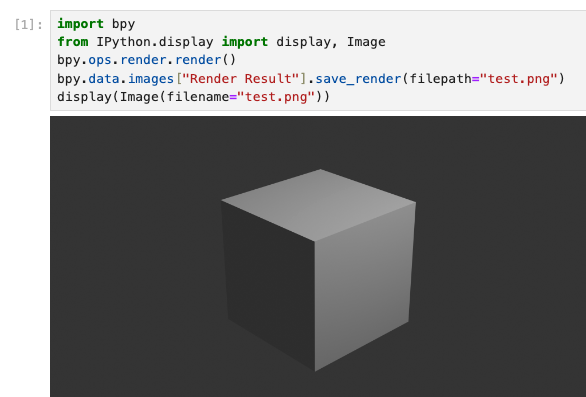

# Getting Started

## How can I use Blender with Python?

It's amazing that Blender has an internal Python editor, but sometimes it can be useful to use a more advanced Python environment like Jupyter notebooks, or VS Code notebooks.

There are two ways to use blender in a notebook:  

  1. **headless-mode**. The Blender Python module "bpy" will be installed from PyPi and the Blender GUI won't open while using bpy in your notebook. It will work even if you don't have a Blender version installed.
  2. **gui-mode**. Here, we'll us the Blender version installe on your system, so that you can interact with Blender from the GUI and send commands from the notebook.

## Using in headless-mode

We're using the package manager [uv](https://docs.astral.sh/uv/getting-started/installation/).  
On mac, you can install uv by `curl -LsSf https://astral.sh/uv/install.sh | sh`

The notebook starts now with:
`uvx --python 3.11 --with bpy==4.2.0 jupyter lab`

The convenient thing about uv: We can run the same command again, and it uses the version that uv cached internally.
No need to use vitual environments, and also no need to manage the python installation yourself.





??? Code

    ```py
    import bpy
    from IPython.display import display, Image
    bpy.ops.render.render()
    bpy.data.images["Render Result"].save_render(filepath="test.png")
    display(Image(filename="test.png"))
    ```

Note, that **headless-mode will *only* run with Python 3.11. (as of Blender 4.2)

# Using in GUI-mode

We first need to install [blender_notebook](https://github.com/cheng-chi/blender_notebook) in order to register the blender kernel to our notebook environment.

Also here, we're using the package manager [uv](https://docs.astral.sh/uv/getting-started/installation/).

On **MacOS**, that's done by
```
uvx blender_notebook install --blender-exec="/Applications/Blender.app/Contents/MacOS/Blender"
uvx --python 3.11 jupyter lab
``` 


On **Windows**, that's #TODO: TEST THIS FIRST, MAYBE ADJUST PATH
```py
uvx blender_notebook install --blender-exec="C:\Program Files\Blender Foundation\Blender 4.2\blender.exe"
uvx --python 3.11 jupyter lab
```

Now you can select the Blender kernel in Jupyter Lab.

Note: in GUI-mode, you can also use other notebook environments, e.g. VS Code notebooks or Saryrn notebooks.