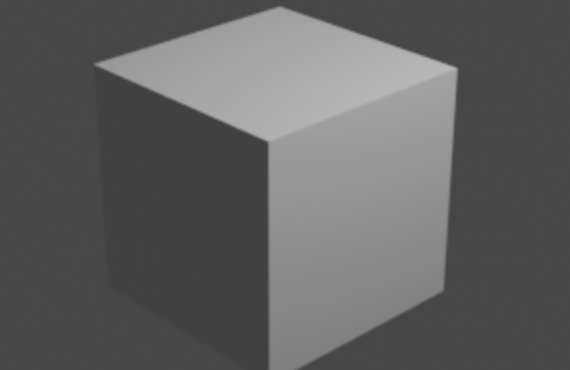

# Blender Snippet Gallery

```py hl_lines="4-9"

import bpy
from IPython.display import display, Image

path = "test.png"
bpy.context.scene.render.resolution_x = 500
bpy.context.scene.render.resolution_y = 200
bpy.ops.render.render()
bpy.data.images["Render Result"].save_render(filepath=path)
display(Image(filename=path))
```



