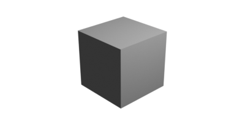

# Rendering settings:

Get current Blender version:
```
import bpy
print(bpy.app.version_string)
#out: 4.2.3 LTS
```

Choosing a **render engine**:


```py hl_lines="4"
import bpy
from IPython.display import display, Image

bpy.context.scene.render.engine = "BLENDER_WORKBENCH"
bpy.context.scene.render.resolution_x = 400
bpy.context.scene.render.resolution_y = 200
bpy.ops.render.render()
bpy.data.images["Render Result"].save_render(filepath="img.png")
display(Image(filename="img.png"))
```


```py hl_lines="1"
bpy.context.scene.render.engine = "BLENDER_EEVEE_NEXT"
bpy.context.scene.render.resolution_x = 400
bpy.context.scene.render.resolution_y = 200
bpy.ops.render.render()
bpy.data.images["Render Result"].save_render(filepath="img.png")
display(Image(filename="img.png"))
```


Setting **sample size** in cycles to 10:

```py hl_lines="1-2"

bpy.context.scene.render.engine = "CYCLES"
bpy.context.scene.cycles.samples = 10  # Set sample size to 100

bpy.context.scene.render.resolution_x = 400
bpy.context.scene.render.resolution_y = 200
bpy.ops.render.render()
bpy.data.images["Render Result"].save_render(filepath="img.png")
display(Image(filename="img.png"))
```


Transparent output:
```py hl_lines="1-3"
bpy.context.scene.render.image_settings.file_format = 'PNG'
bpy.context.scene.render.image_settings.color_mode = 'RGBA'
bpy.context.scene.render.film_transparent = True


bpy.context.scene.render.resolution_x = 400
bpy.context.scene.render.resolution_y = 200
bpy.ops.render.render()
bpy.data.images["Render Result"].save_render(filepath="img.png")
display(Image(filename="img.png"))
```
